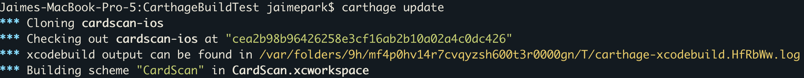
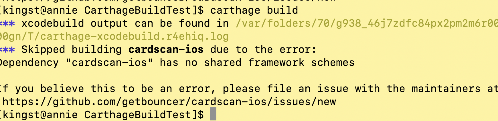
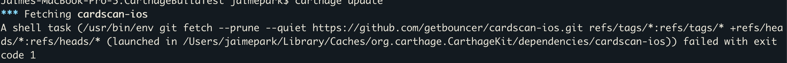

# cardscan-carthage-example
### In `/CarthageBuildTest`
1. Check that the `Cartfile` is pointing to the correct cardscan repo (i.e. master)
   ```
   github "getbouncer/cardscan-ios" "master" 
   ```
2. Run ```carthage update``` and ```carthage build```. If there are no errors, it is a successful build.


### Possible Errors: 
* **No shared frameworks found**

    * Go back to `cardscan-ios`
    * Reclick `shared` in the scheme manager
    * Recommit and push to master
    * Update & build carthage  
    
*  **A shell task ... (launched in ~/somePath/.CarthageKit/dependencies/cardscan-ios) failed with exit code 1**

    * rm -rf the cache path
    * Update & build carthage
